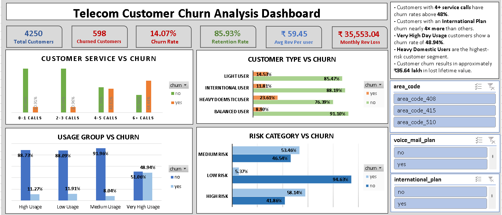

# Telecom Customer Churn Analysis

## Project Overview

Customer churn is one of the biggest challenges faced by telecom companies because acquiring new customers is significantly more expensive than retaining existing ones.

This project analyzes customer behavior patterns, identifies the key drivers of churn, estimates the financial impact of customer attrition, and develops a rule-based churn prediction model using Microsoft Excel 2019.

The project concludes with an interactive executive dashboard designed to support data-driven retention strategies.

---

## Business Objective

The primary objectives of this project are:

- Identify the major factors contributing to customer churn.
- Segment customers based on usage patterns and service behavior.
- Develop a churn risk scoring model.
- Quantify the financial impact of churn.
- Provide actionable business recommendations to improve customer retention.

---

## Tools Used

- Microsoft Excel 2019
- Pivot Tables
- Pivot Charts
- Conditional Formatting
- Excel Formulas
- Slicers
- Git & GitHub

---

## Dataset Information

| Metric | Value |
|--------|-------|
| Total Customers | 4,250 |
| Total Features | 20 |
| Churned Customers | 598 |
| Active Customers | 3,652 |
| Churn Rate | 14.1% |
| Retention Rate | 85.9% |

---

## Analysis Performed

### Basic Analysis
- Churn distribution analysis
- State-wise churn analysis
- International plan analysis
- Voice mail plan analysis
- Customer service call analysis
- Usage behavior analysis

### Intermediate Analysis
- Area code segmentation
- Customer tenure analysis
- International charge analysis
- Customer service threshold analysis
- Voice mail usage analysis
- Customer segmentation

### Advanced Analysis
- Rule-based churn prediction model
- Customer segmentation analysis
- Interaction effect analysis

---

## Key Findings

### 📞Customer Service Calls
Customers making more than 3 customer service calls show a significant increase in churn risk.
| Service Calls | Churn Rate |
|--------------|-----------|
| 0-1 Calls | 10.91% |
| 2-3 Calls | 10.96% |
| 4-5 Calls | 48.62% |
| 6+ Calls | 64.44% |

---

### International Plan Impact

Customers subscribed to an international plan churn at nearly four times the rate of customers without an international plan.

| International Plan | Churn Rate |
|-------------------|-----------|
| No | 11.18% |
| Yes | 42.17% |

---

### Voice Mail Plan Impact

Customers with a voice mail plan demonstrate stronger retention behavior.

| Voice Mail Plan | Churn Rate |
|----------------|-----------|
| No | 16.44% |
| Yes | 7.37% |

---

### Day Usage Threshold

Very high daytime users exhibit significantly higher churn behavior.

| Usage Group | Churn Rate |
|------------|-----------|
| Low Usage | 11.91% |
| Medium Usage | 8.04% |
| High Usage | 11.27% |
| Very High Usage | 48.94% |

---

### Customer Segmentation

| Segment | Churn Rate |
|---------|-----------|
| Balanced User | 8.90% |
| International User | 11.81% |
| Light User | 14.53% |
| Heavy Domestic User | 23.61% |

---

### Risk Categories

| Risk Category | Churn Rate |
|--------------|-----------|
| Low Risk | 5.37% |
| Medium Risk | 53.46% |
| High Risk | 58.14% |

The model helps identify high-risk customers for proactive retention efforts.

---

## Economic Impact of Churn

| Metric | Value |
|--------|-------|
| Average Revenue Per User (ARPU) | ₹59.45 |
| Average Customer Lifetime Value (CLV) | ₹5,959.37 |
| Monthly Revenue Loss | ₹35,553.04 |
| Total CLV Loss | ₹35,63,702.63 |

---

## Dashboard

The project includes a one-page executive dashboard providing:

- Customer overview KPIs
- Churn drivers
- Risk segmentation
- Customer segmentation
- Financial impact analysis
- Interactive filtering using slicers


---

## Business Recommendations

### 1. Improve Customer Support Resolution
Customers with repeated customer service interactions exhibit extremely high churn risk.

### 2. Reevaluate International Plan Pricing
International plan subscribers show significantly higher churn rates.

### 3. Target Heavy Domestic Users
Heavy domestic users represent the highest-risk customer segment.

### 4. Introduce High Usage Plans
Very high daytime users appear to be highly price sensitive.

### 5. Implement Proactive Retention Campaigns
The risk model can be used to identify customers requiring early intervention.

---
```text
telecom-customer-churn-analysis/
│
├── data/
│   ├── Raw Data
│   └── Clean Data
│       
├── excel/
│   ├── telecom_churn_analysis.xlsx   
│
├── dashboard/
│   └── telecom_churn_dashboard.xlsx
│
├── docs/
│   ├── business_questions.pdf
|
├── Reports/
│   └── Telecom_Churn_Report.pdf
│
├── images/
│   ├── dashboard_preview.png
│
├── README.md
└── .gitignore
```

## Author

**Utkarsh Dhangar**  
Aspiring Data Analyst | Excel | SQL | Python | Power BI